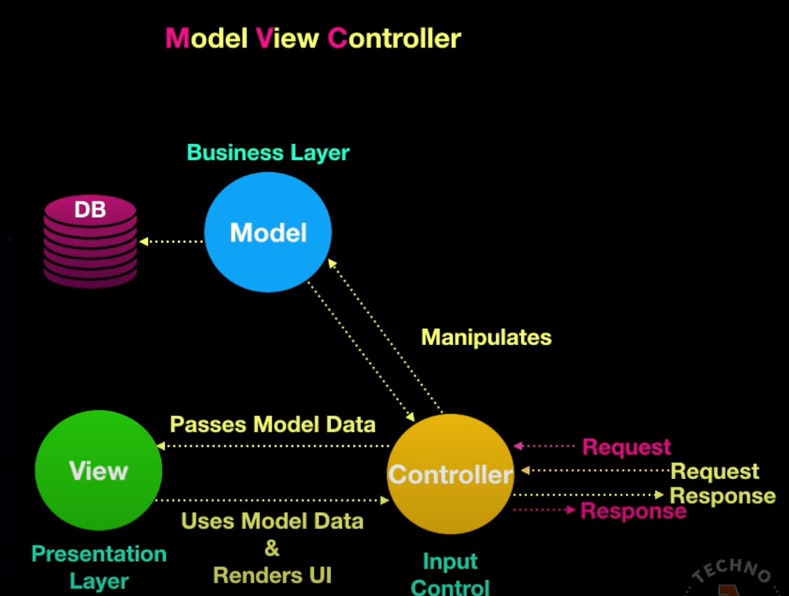
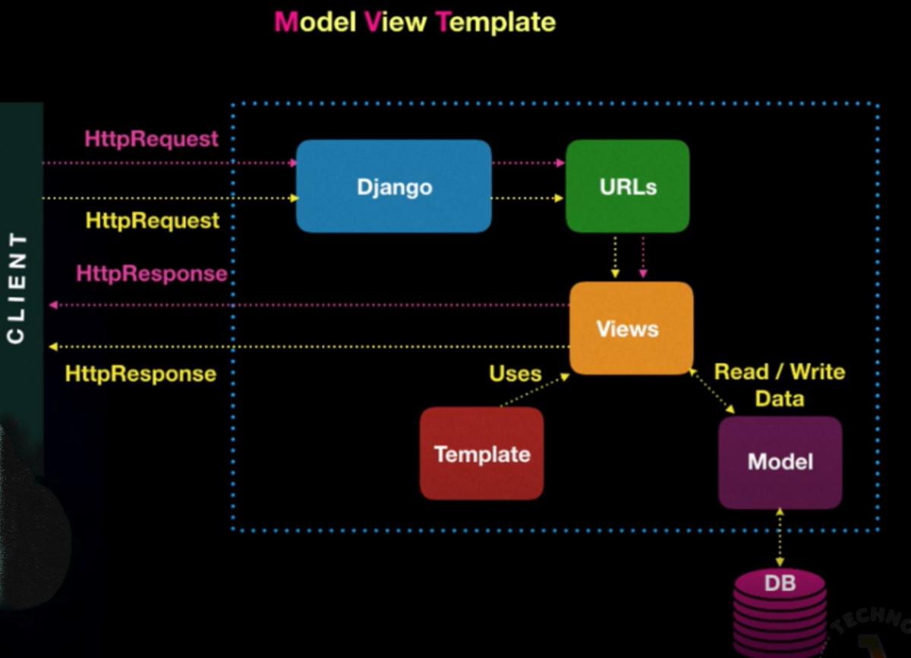

# MVC vs MVT

# MVC




# MVT


```
```

# MVC en CODE

El patrón MVC (Modelo-Vista-Controlador) es una forma de organizar el código en una aplicación web para que sea más fácil de mantener y entender. Aquí tienes una explicación simple y ejemplos de cómo implementarlo usando Express.js, Node.js y Sequelize (un ORM para bases de datos relacionales en JavaScript).

## MODEL

Modelo: El modelo representa los datos de la aplicación y cómo interactuar con ellos. En una aplicación web, los modelos suelen ser clases que representan tablas de la base de datos.Ejemplo con Sequelize:
```javascript
// Definición del modelo User con Sequelize
const { DataTypes } = require('sequelize');
const sequelize = new Sequelize('sqlite::memory:');

const User = sequelize.define('User', {
  firstName: {
    type: DataTypes.STRING,
    allowNull: false
  },
  lastName: {
    type: DataTypes.STRING,
    allowNull: false
  }
});

module.exports = User;
```
## VIEW

Vista: La vista es la parte de la aplicación que se encarga de mostrar la interfaz de usuario y enviar datos al cliente. En Express.js, las vistas son archivos de plantilla (como EJS, Handlebars, Pug, etc.) que se renderizan y envían al navegador.Ejemplo con Express.js y Handlebars:
```javascript
// Configuración de Handlebars como motor de plantillas en Express
const express = require('express');
const exphbs  = require('express-handlebars');
const app = express();

app.engine('.hbs', exphbs({ extname: '.hbs' }));
app.set('view engine', '.hbs');

// Ruta para mostrar la vista
app.get('/', (req, res) => {
  res.render('index', { title: 'Home', message: 'Hello World!' });
});

app.listen(3000, () => {
  console.log('Server is running on port 3000');
});
```

Y en el archivo views/index.hbs:
```html
<h1>{{ title }}</h1>
<p>{{ message }}</p>
```
## CONTROLLER

Controlador: El controlador actúa como intermediario entre el modelo y la vista. Se encarga de procesar las solicitudes del cliente, interactuar con el modelo si es necesario y enviar datos a la vista para que se muestren al usuario.Ejemplo con Express.js:
```javascript
// Controlador para manejar la ruta '/'
const express = require('express');
const router = express.Router();

// Importar el modelo User
const User = require('../models/User');

// Manejar la solicitud GET en la ruta '/'
router.get('/', async (req, res) => {
  try {
    // Obtener todos los usuarios desde la base de datos
    const users = await User.findAll();
    // Renderizar la vista y enviar los datos
    res.render('index', { title: 'Users', users });
  } catch (err) {
    // Manejar errores
    console.error(err);
    res.status(500).send('Internal Server Error');
  }
});

module.exports = router;
```

# MVT en CODE

En Django, el patrón de diseño utilizado es el MVT (Modelo-Vista-Templado). 

## MODEL

Modelo: En Django, los modelos son clases que representan las tablas de la base de datos.
```python
# models.py
from django.db import models

class Post(models.Model):
    title = models.CharField(max_length=100)
    content = models.TextField()
    date_posted = models.DateTimeField(auto_now_add=True)

    def __str__(self):
        return self.title
```

## VIEW

Vista: Las vistas en Django son funciones o clases que procesan las solicitudes del cliente y devuelven una respuesta.
```python
# views.py
from django.shortcuts import render
from .models import Post

def home(request):
    posts = Post.objects.all()
    return render(request, 'blog/home.html', {'posts': posts})
```
## TEMPLATE

Templado: Los templates en Django son archivos HTML que definen cómo se verá la interfaz de usuario.
```html
<!-- home.html -->
<!DOCTYPE html>
<html>
<head>
    <title>Blog</title>
</head>
<body>
    <h1>Blog</h1>
    
    <div>
        <h2>{{ post.title }}</h2>
        <p>{{ post.content }}</p>
        <p>Posted on: {{ post.date_posted }}</p>
    </div>
    
</body>
</html>
```
Con esto, cuando un usuario accede a la página de inicio (/), Django ejecutará la función home en views.py, que recuperará todos los posts del modelo Post y los pasará al template home.html, que se renderizará y enviará como respuesta al navegador del usuario.